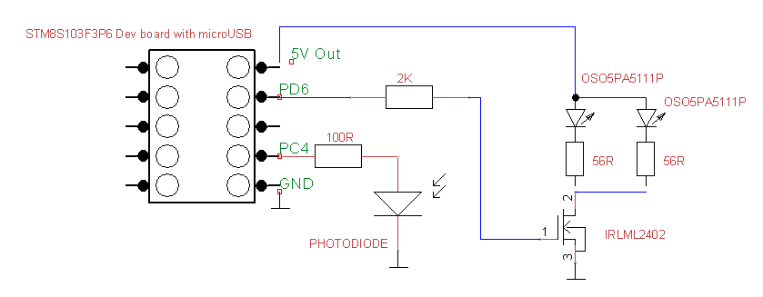

# stm8

<b>NightLight</b> 
IAR project for STM8S103F3P6 mcu.
Photodiode is connected to internal ADC and used for light level monitoring. 
When light level is low, LED will be turned on via logic-level MOSFET transistor. 
